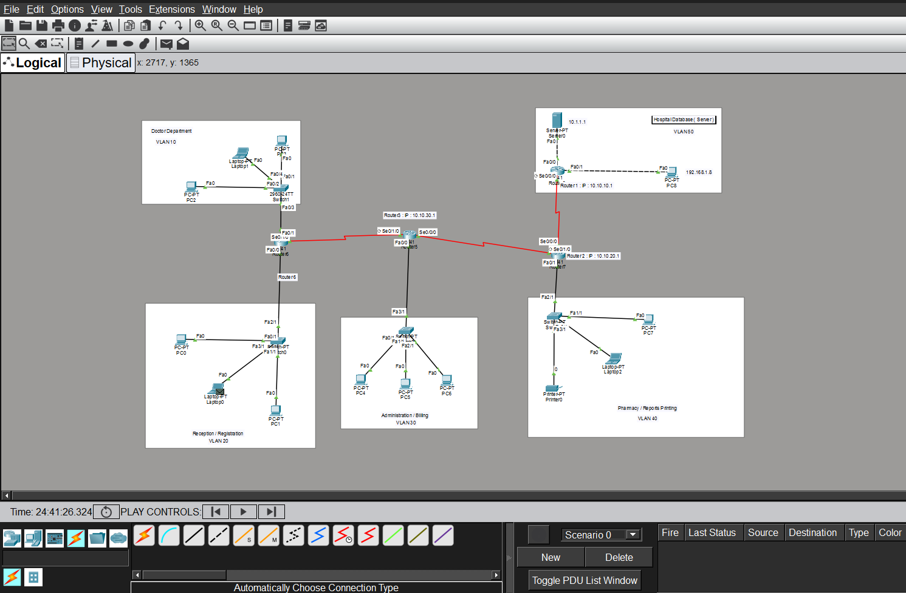

# 🏥 Hospital Management System — Network Topology
> A fully configured enterprise network simulation built in **Cisco Packet Tracer**



---

## 📋 Project Overview

This project simulates a complete **Hospital Management System Network** with multiple departments connected across buildings using VLANs, Dynamic Routing, DHCP, and Security configurations.

---

## 🗺️ Network Topology

```
DHCP-SERVER
     |
    SW1 (VLAN 10) ── MAIN-R1 ──[Serial]── BRANCH-R2 ──[Serial]── BRANCH-R3
     |                                          |                      |
   PC1, PC2                                   SW2                    SW3
                                           (VLAN 20)              (VLAN 30)
                                          PC3, PC4               PC5, PC6
```

---

## ⚙️ Features Implemented

| Feature | Description |
|---|---|
| ✅ **VLAN Configuration** | 3 VLANs for department isolation |
| ✅ **Inter-VLAN Routing** | Router-on-a-Stick method |
| ✅ **DHCP Server** | Dedicated Server-PT for automatic IP assignment |
| ✅ **RIP Dynamic Routing** | Version 2, no auto-summary |
| ✅ **Network Security** | Enable secret, Console & VTY passwords, Encryption |
| ✅ **Trunk Ports** | Switch-Router links |
| ✅ **Telnet Access** | Remote router management |
| ✅ **ip helper-address** | DHCP relay for remote VLANs |

---

## 🌐 IP Addressing Scheme

### VLANs
| VLAN | Name | Network | Gateway |
|---|---|---|---|
| 10 | MAIN_LAN | 192.168.10.0/24 | 192.168.10.1 |
| 20 | BRANCH1_LAN | 192.168.20.0/24 | 192.168.20.1 |
| 30 | BRANCH2_LAN | 192.168.30.0/24 | 192.168.30.1 |

### WAN Links
| Link | Network | Router IPs |
|---|---|---|
| R1 ↔ R2 | 10.10.10.0/30 | R1=10.10.10.1 (DCE) / R2=10.10.10.2 (DTE) |
| R2 ↔ R3 | 10.10.20.0/30 | R2=10.10.20.1 (DCE) / R3=10.10.20.2 (DTE) |

### Devices
| Device | Hostname | IP |
|---|---|---|
| Router 0 | MAIN-R1 | 192.168.10.1 / 10.10.10.1 |
| Router 1 | BRANCH-R2 | 192.168.20.1 / 10.10.10.2 / 10.10.20.1 |
| Router 2 | BRANCH-R3 | 192.168.30.1 / 10.10.20.2 |
| Server-PT | DHCP-SVR | 192.168.10.2 |

---

## 🔧 Technologies Used

- **Cisco Packet Tracer** — Network simulation
- **RIP v2** — Dynamic routing protocol
- **802.1Q (dot1Q)** — VLAN trunking
- **DHCP** — Automatic IP assignment via Server-PT
- **Telnet** — Remote device management

---

## 📁 Project Structure

```
hospital-network/
│
├── README.md               ← You are here
├── topology.png            ← Network diagram screenshot
└── Hospital_Network.pkt    ← Cisco Packet Tracer file
```

---

## 🚀 How to Run

1. Download and install **Cisco Packet Tracer**
2. Open `Hospital_Network.pkt`
3. Click any PC → Desktop → Command Prompt
4. Test connectivity:
```
ping 192.168.10.1    (local gateway)
ping 192.168.20.1    (cross VLAN)
ping 192.168.30.1    (cross building)
```

---

## 🔐 Device Credentials

| Access Type | Username | Password |
|---|---|---|
| Enable (Privileged) | — | cisco123 |
| Console | — | cisco |
| Telnet (VTY) | — | cisco |

---

## 📸 Screenshots


---

## 👨‍💻 Author

**Mohsin Ali**
- GitHub: [@mohsin-ali08](https://github.com/mohsin-ali08)

---

## 📄 License

This project is for educational purposes — Computer Networks Lab Assignment.
